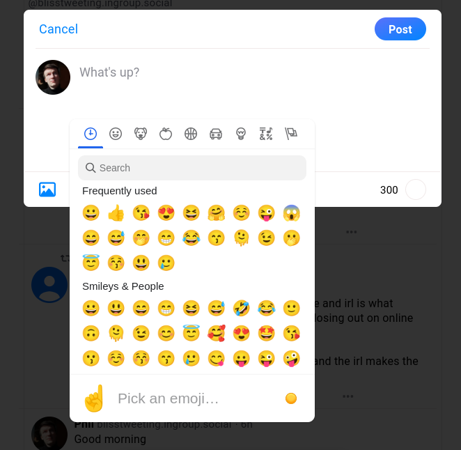

## Bluesky Overhaul

This is a small (and hopefully temporary) extension for Chrome that adds some nice and handy features to [Bluesky](https://bluesky.app/), the greatest media platform of all time.

Right now (as of April 11, 2023), the app is invite-only and the web app is running at https://staging.bsky.app/ (you may find yours truly at [@blisstweeting.ingroup.social](https://staging.bsky.app/profile/blisstweeting.ingroup.social)).

You may also want to support my other [project that is currently in development](https://www.patreon.com/architectofthought).

### Features

This is what's ready, and you also may request new features in issues.

#### Emoji picker



#### Auto quote-posting

When you paste a link to someone's post:
- removes "staging." from the URL
- clicks the "Add link card" button for you
- **only works if the URL is at the end of the pasted text**
- you can remove the link from the text after the card is loaded

#### Exit post composing modal window

You can now exit the modal window by pressing `Esc` or clicking outside of it.

#### Send posts with `Ctrl+Enter`

That's pretty much self-explanatory.

#### Keyboard navigation for photos

You can navigate through photos with `←` and `→` keys and close the modal window with `Esc`.

### Local build

```
npm install
npx webpack
```
