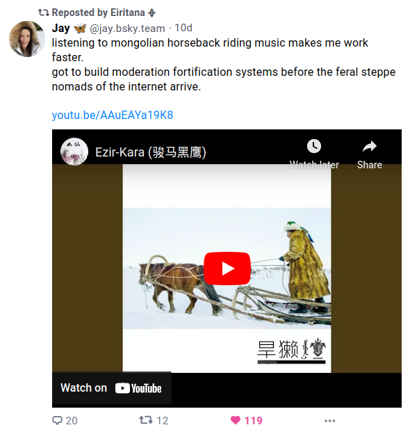

# Bluesky Overhaul

[](https://chrome.google.com/webstore/detail/bluesky-overhaul/cllpkmbebfmadmkkpplnaaffnhjjpgbi)
[](https://addons.mozilla.org/en-US/firefox/addon/bluesky-overhaul/)

[](https://etherscan.io/address/0x567ccDD062Ec253293B2A3C0459A86c00CdDfDbe)
[](https://liberapay.com/blisstweeting)
[](https://www.patreon.com/architectofthought)

This is a small extension for [Chrome](https://chrome.google.com/webstore/detail/bluesky-overhaul/cllpkmbebfmadmkkpplnaaffnhjjpgbi) (and partially [Firefox](https://addons.mozilla.org/addon/bluesky-overhaul/)) that adds some nice and handy functionality to [Bluesky](https://bsky.app/), the greatest media platform of all time.

Right now (as of December 2023), the app is invite-only and the web app is running at [bsky.app](https://bsky.app/) (you may find yours truly at [@blisstweeting.xyz](https://bsky.app/profile/blisstweeting.xyz)).

## Table of contents

- [Features](#features)
- [Development](#development)

## Features

Implemented features are listed here. For the planned ones, see [Issues](https://github.com/xenohunter/bluesky-overhaul/issues). Also, some new ideas may appear in [this Bluesky thread](https://staging.bsky.app/profile/blisstweeting.ingroup.social/post/3jszn6rreec2i) (login required). You can also [create an issue](https://github.com/xenohunter/bluesky-overhaul/issues/new) if you have a feature request.

### Auto quote-posting

When you paste a link to someone's post:
- removes "staging." from the URL
- clicks the "Add link card" button for you
- **only works if the URL is at the end of the pasted text**
- you can remove the link from the text after the card is loaded

### YouTube embeds in feed, profile, and post pages

YouTube player now appears beside YouTube links on some pages (not in search results yet).



### Vim keybindings

You can now use `j` and `k` to traverse posts, `l` to like, and `?` to look up the list of all keybindings. (There are 11 or more different actions configured, depending on the extension version.)

### Hide followers, following, and posts counts from profiles

Pretty self-explanatory!

### Settings popup

You can now change some settings in the extension popup window. You can also disable the extension from that popup if something is buggy, and it will turn back on when the next version is released.

### Popovers with precise time for post links

When you hover over a link to a post, you'll see a popover with the exact time of the post.

## Development

### Local build

```
npm install
npm run build:dev
```

### Development guide

Unsorted _temporary_ notes about how to approach development:

1. If you want to implement a feature, please:
   - Add an issue to the [Issues](https://github.com/xenohunter/bluesky-overhaul/issues) section if it's not there already.
   - Discuss it with [Phil](https://github.com/xenohunter) and draft an approximate plan.
   - Assign it to yourself.
   - Implement and test it.
     - It should pass the eslint checks.
   - Create a pull request.
2. Please, make sure to run the pre-commit hook.
   - Soon, I'll add a CI pipeline that will run it on GitHub.
3. So far, there are two major abstractions for any behavior: `Watcher` and `Pipeline`:
   - **Watchers** wait for events globally and react to those.
   - **Pipelines** are deployed and terminated for specific DOM elements.
   - If you need a new abstraction, please discuss it with [Phil](https://github.com/xenohunter) first.
4. Finding elements in the DOM is a mess right now. It's on my personal vendetta refactoring list.
   - Some of it happens in the _elementsFinder.js_ file (because it's needed in more than one place) and some of it does not. I'll probably put everything into that one file, but I have to organize it better.
